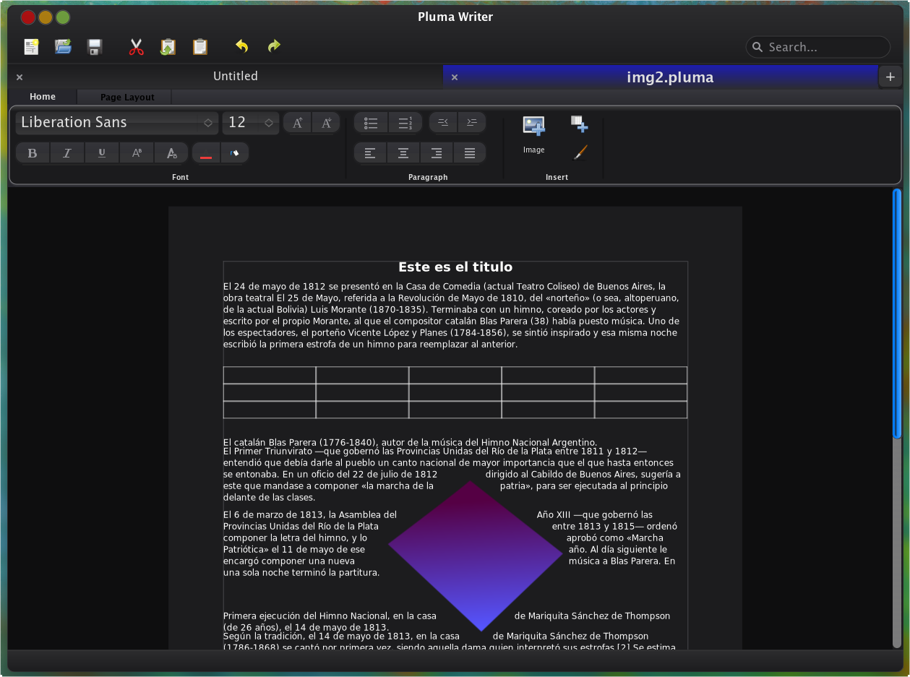

<div align="center">
  

  <br />
  <br />

  <h1>🖋️ Pluma Writer</h1>
  <p>
    <b>A lightweight, fast, and elegant text editor built using the Horizon framework for Austral OS.</b>
  </p>

  <br />

  [](LICENSE)
  []()
</div>

---

## ✨ Features

- **Beautifully crafted interface:** Designed to keep you focused on your writing without distractions.
- **Fast and lightweight:** Built with performance in mind using C++ and CMake.
- **Modern aesthetics:** Smooth UI and carefully designed layouts.
- **Ribbon interface:** Provides quick access to all the tools you need.

## 🚀 Getting Started

### Prerequisites

Ensure you have the following installed to build Pluma from source:
- `cmake` (version 3.20 or higher)
- A modern C++20 compiler (GCC, Clang, or MSVC)
- `pkg-config`
- `cairo`
- `fontconfig`
- `horizon` (Horizon UI Framework)
- `libpluma` (Pluma core library)

### Building from Source

1. Clone the repository:
   ```bash
   git clone https://github.com/your-username/pluma.git
   cd pluma
   ```

2. Generate the build files using **Ninja**:
   ```bash
   mkdir build && cd build
   cmake .. -G Ninja
   ```

3. Compile the application:
   ```bash
   ninja
   ```

### 📦 Generating a Debian Package

```bash
# Inside the build/ folder
ninja package

# Generates:
# pluma-writer-0.8.0-Linux.deb

# To install:
sudo dpkg -i pluma-writer-0.8.0-Linux.deb
```

> **Note:** The `build/` folder is fully regenerable. If you delete it, just run
> `cmake .. -G Ninja` inside a new `build/` folder and all capabilities
> (including `ninja package`) will be restored.


## 📄 License

This project is licensed under the GPL-3.0 License. See the [LICENSE](LICENSE) file for more details.

---
<div align="center">
  <sub>Made with ❤️ by the Pluma Contributors</sub>
</div>
